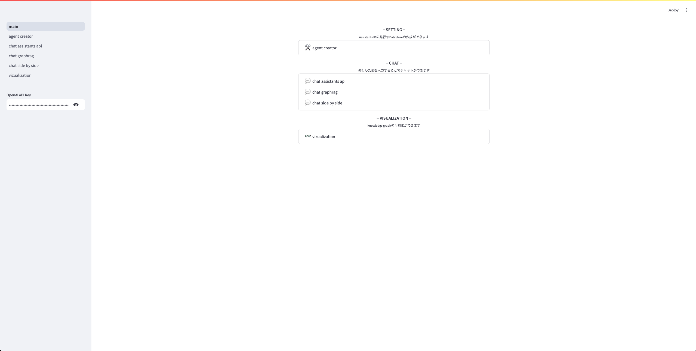
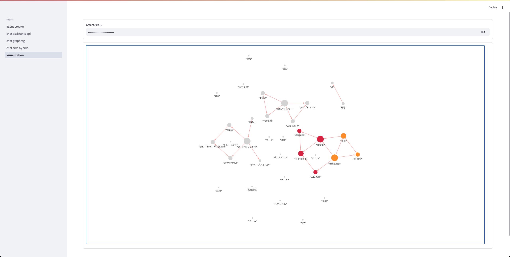

# RAG Demo on Streamlit



## Quick Start

1. 依存のインストール

   ```bash
   pip install -r requirements.txt
   ```

2. streamlit app の起動

   ```
   streamlit run main.py
   ```

3. http://localhost:8501/ にアクセスする
